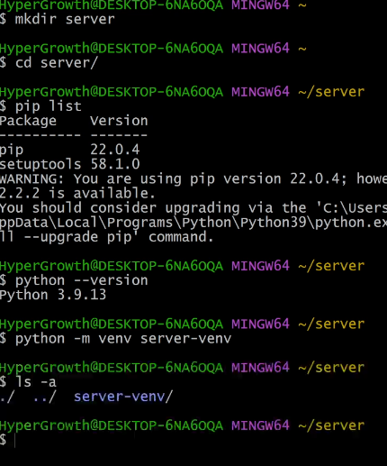

#### 웹 서비스 개발에는 무엇이 필요할까? 

- 로그인, 로그아웃, 회원관리, 데이터베이스, 서버, 클라이언트, 보안등
- 너무 많은 기술들이 필요하다 그렇다면 이걸 어떻게 다 만들어야 할까?
- 모든것을 직접 만들기 보다 잘 만들어진 것들을 가져와서 좋은 환경에서 잘 사용가능
  - "**거인의 어깨 위에서 프로그래밍 하기**"

#### Framework 이해하기 

- 누군가 만들어 놓은 코드를 **재사용** 하는 것은 이미 익숙한 개발 문화
- '웹 서비스'도 누군가 개발해 놓은 코드를 재사용하면 된다. 
- 전 세계의 수많은 개발자들이 이미 수 없이 많이 개발해 봤고, 그 과정에서 자주 사용되는 부분들을 재사용 할 수 있게 좋은 구조의 코드로 만들어 두었다. 

#### Django를 배워야하는 이유 

- python으로 작성된 프레임워크 
- python이라는 언어의 강력함과 거대한 커뮤니티
- 수많은 여러 유용한 기능들 
- 검증된 웹 프레임워크 
  - 화해, Toss, 두나무, 당근마켓, 요기요 등
  - 유명한 많은 서비스들이 사용한다는 것 == 안정적으로 서비스를 할 수 있다는 검증 

---

### ✔ WEB(World Wide *Web*)이해하기 

#### 인터넷이란? (INTER + NET) : 서로 연결되어있다. 

- 우리가 Google에 접속 할 때 
  - 웹 브라우저를 켠다. 
  - 주소창에 주소를 입력한다. 

#### 연결되어 있는 세계 

* 우리가 Google 홈페이지에 접속할 수 있는 이유는, Google 본사 컴퓨터와 우리의 컴퓨터 간의 통신이 연결되어 있기 때문 

- 결국 우리가 인터넷을 이용한다는 건, 전 세계의 

---

### ✔ 클라이언트와 서버 

서비스 제공자 

고객들에게 무언가를 제공하는 것 

#### 클라이언트

#### 서버 

223.130.200.104 실제 네이버 주소 

누구 : naver.com 

무엇 : /

----

### web browser 와 web page

#### 웹 브라우저란? 

ex) 회사 소개 홈페이지, 팀 소개 페이지 = static

네이버는 다이나믹

---

### Django 구조 이해하기 

---

장고 설치 

---

---

localhost:8000

----

---

만든것

에서 시작 

옆집은 옆집에서 놀고있기 떄문에 설치해줘야함

