### **💡 Django 개발 환경 설정 가이드**

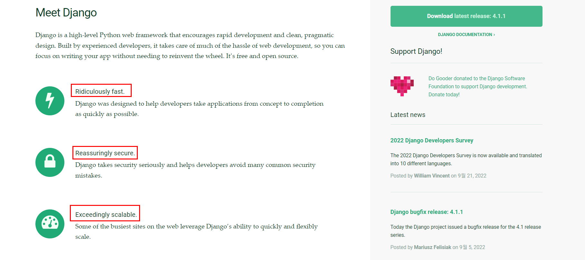

---

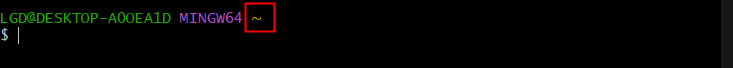

> * ~ 물결 표시 : 현재 접속 중인 사용자의 홈 디렉터리 

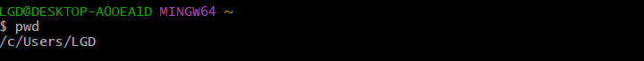

> * pwd : 현재 디렉토리 위치 확인 

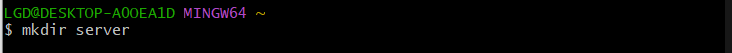

> * server 파일 생성

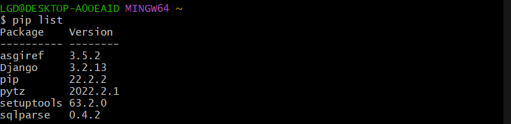

> * pip list 를 통해 설치된 프로그램 확인하기 

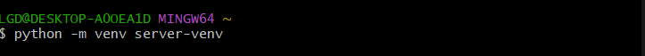

> * python -m venv server-venv

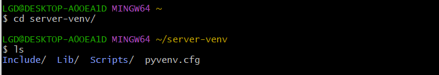

> * 가상환경을 유지하기 위한 설정파일이 있다는 것을 알 수 있다. 

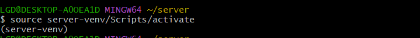

> * source server-venv/Scripts/activate
>   * server-venv에서 생존 
>   * 바깥세상에 영향을 주지도 받지도 않는다. 

> * **삭제하기**   **deactivate**

---

### ✔ 장고 설치 

#### $ pip install django==3.2.13

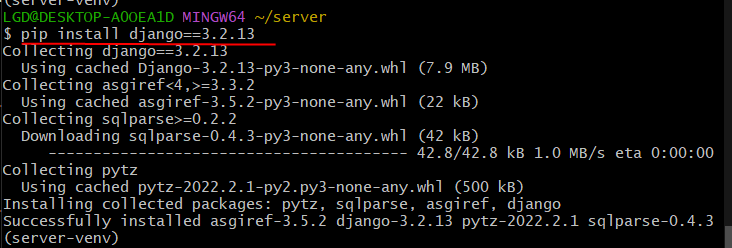

> * pip list를 통해 설치된 것을 확인 할 수 있음 

> **django-admin startproject [프로젝트 이름] [시작경로 ]**

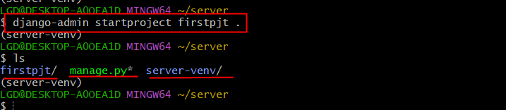

> **vscode 실행**

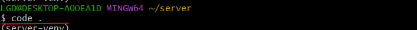

> **vscode를 통해 파일 확인 **

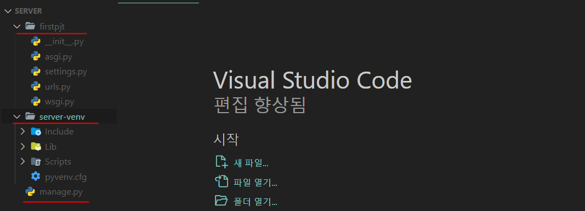

> * #### 서버 실행
>
> **python manage.py runserver** 

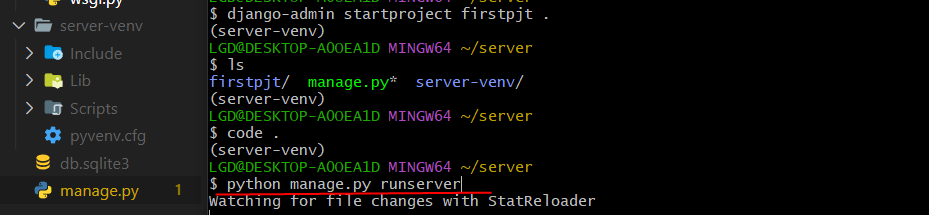

> ##### 🚀 서버 실행 확인하기 _ 첫번째 웹 서버 만든 것  
>
> 
>
> 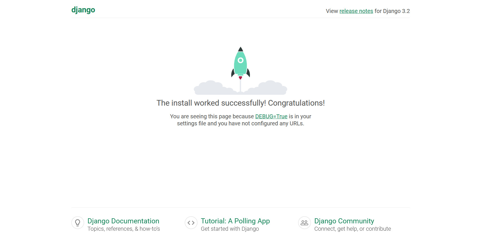

