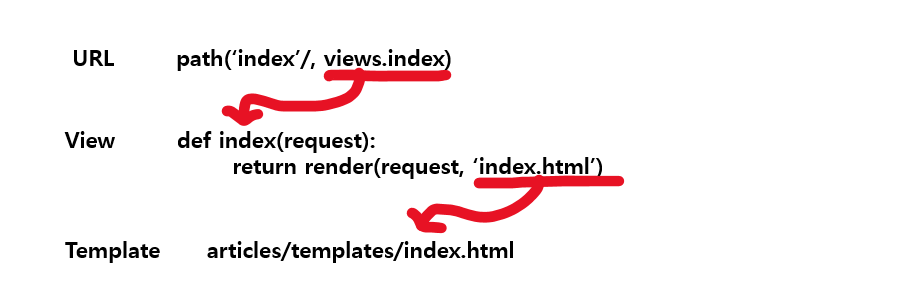

### 💡 URLs_ 주문서 

* **URL => VIEW => TEMPLATE**
* 기초 과정을 작성해보고 데이터 흐름 확인해보기 

```python
# urls.py
from django.contrib import admin
from django.urls import path
from articles import views

urlpatterns = [
path('admin/', admin.site.urls),
path('index/', views.index),
]
```


### 💡 Views

* HTTP 요청을 수신하고 HTTP응답을 변환하는 함수 작성 
* Template에게 HTTP 응답 서식을 맡김 

```python
# articles/views.py
# index(요청정보)

def index(request):
    #환영하는 메인 페이지를 보여준다. 
    #첫번째 인자 꼭 포함 request
return render(request, 'index.html')
```


### 💡 Templates

* 실제 내용을 보여주는데 사용되는 파일 
* 파일의 구조나 레이아웃을 정의 
* Template파일의 기본 경로 
  * app폴더 안의 templates 폴더 
  * app_name/templates/

```html
<!-- articles/templates/index.html -->
<!DOCTYPE html>
<html lang="en">
<head>
<!-- 생략 -->
</head>
<body>
<h1>만나서 반가워요!</h1>
</body>
</html>
```


#### 코드 작성 순서 

* **데이터의 흐름 순서** 

