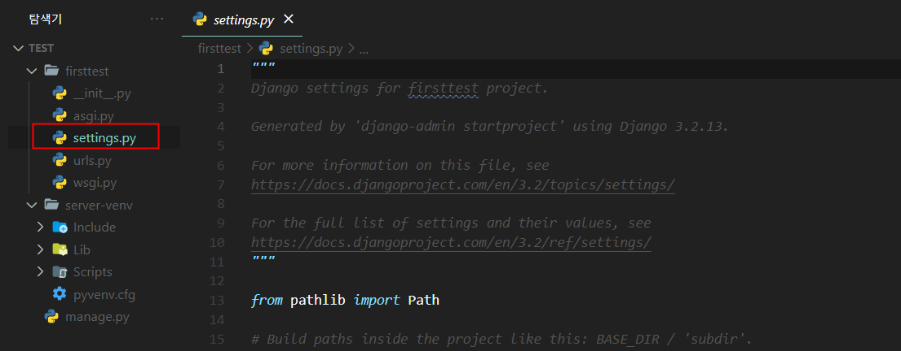
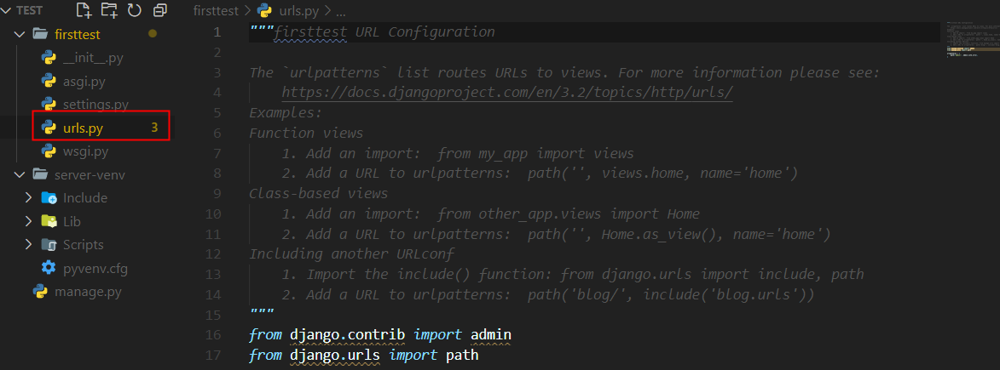
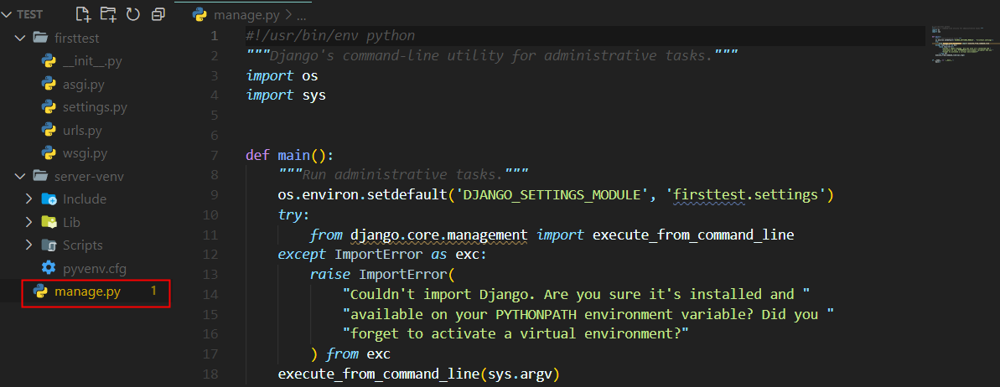
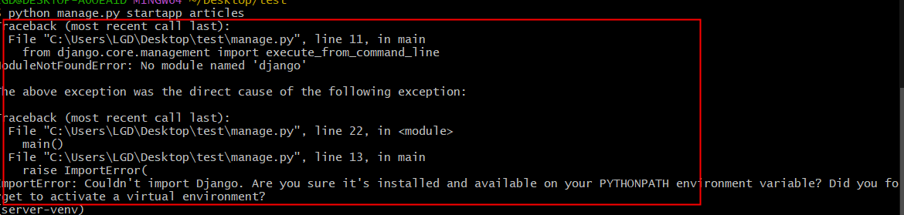
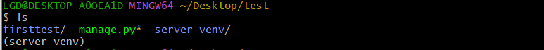
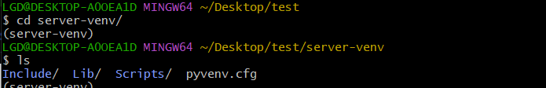
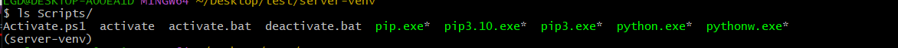
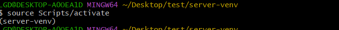
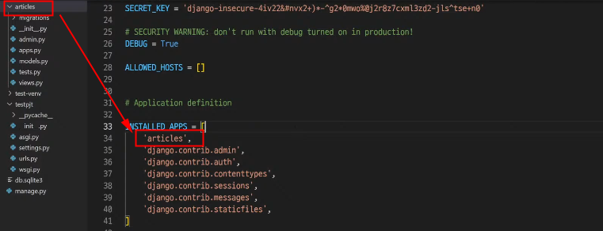

### 💡 Django

```bash

# 가상환경 생성
python -m venv [가상환경이름]

# 가상환경 실행
# ls 명령어 입력 후 현재 경로에서 가상환경 폴더 확인
# 윈도우
. [가상환경이름]/Scripts/actiave

# 맥
. [가상환경이름]/bin/activate

# django LTS 버전 설치
pip install django==3.2.13

# 앱 생성
# ls 명령어 입력 후 현재 경로에서 manage.py 파일 확인
python manage.py startapp [앱이름]

# 앱 등록
# 프로젝트설정폴더/settings.py - INSTALLED_APPS 리스트에 생성한 앱 추가

# 서버 실행 테스트
python manage.py runserver
```


---


> #### settings.py
>
> * Django 프로젝트 설정을 관리 




> #### urls.py
>
> * 사이트의 url과 적절한 views의 연결을 지정 




> #### manage.py
>
> * Django 프로젝트와 다양한 방법으로 상호작용 하는 커맨드라인 유티리티 




> #### error 
>
> 


---









---


> #### ⭐ views.py 
>
> * views 함수들이 정의 되는 곳 
> * MTV 패턴의 V에 해당  


---

⭐ **이름이 동일해야 한다. **



```python
# settings.py
INSTALLED_APPS = [
'articles', 
'django.contrib.admin',
'django.contrib.auth',
'django.contrib.contenttypes',
'django.contrib.sessions',
'django.contrib.messages',
'django.contrib.staticfiles',
]
```


---

#### Project & Application 

* Project 
  * collection of apps
  * 프로젝트는 앱의 집합 
  * 프로젝트에는 여러 앱이 포함될 수 있음 
  * 앱은 여러 프로젝트에 있을 수 있음 
* Application 
  * 앱은 실제 요청을 처리하고 페이지를 보여주는 등의 역할을 담당 
  * 일반적으로 앱은 하나의 역할 및 기능 단위로 작성하는 것을 권장함 

---


