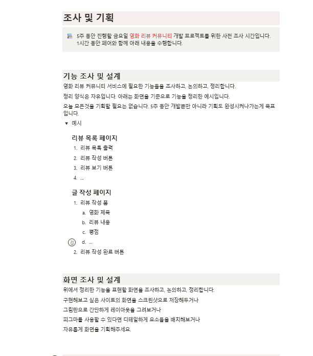

깔끔하게 정보를 전달하는 틀 

모든 영화의 리뷰와 평점 

큰틀 디자인 => cgv

소통할 수 있는 카테고리 

* 소통 : 글, 댓글, 좋아요 

* 유튜브 : 영화 리뷰 영상 참고?해보면서 소통할 수 있는? 

* 인스타그램처럼 gif  특정 장면 (명장면) 가져와서 소통할 수 있는 릴스같은 

* 챌린지 오늘같이 보기 ✔ 주기적 
  * 경험(함께), 감성 자극, 이것이 곧 무기 

* cgv 연계 영화표 / 시사회 / 할인 

* mbti 어울리는 영화 데이터화 베너 메인 보여주고 추천해주는? 

* 대화유도 / 영화에 대한 질문지 < 서비스 

  * 스파이더맨  
  * 여기서 스파이더맨이 어떠한 행동을 할 수 밖에 없었다면 왜 그렇게 했을까?
  * 내가 스파이더맨이라면? 어떤 선택? => 글 보다는 < 미니 게임 yes or no

  

  

  - ----

  순서 중요 

  ---

  

자유게시판 / 필요한 정보만 보일 수 있도록  

특정 영화 

### 기능 조사 및 설계

#### 영화 리뷰 커뮤니티 서비스에 필요한 기능들을 조사하고, 논의하고, 정리

리뷰 커뮤니티 서비스

리뷰 

커뮤니티 

넷플릭스 , 왓쳐 

### 리뷰 목록 페이지

1. 리뷰 목록 출력
2. 리뷰 작성 버튼
3. 리뷰 보기 버튼
4. …

### 글 작성 페이지

1. 리뷰 작성 폼
   1. 영화 제목
   2. 리뷰 내용
   3. 평점
   4. …
2. 리뷰 작성 완료 버튼