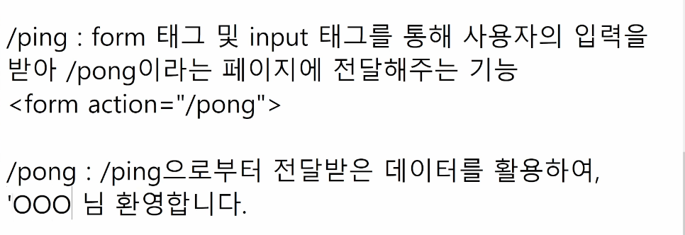
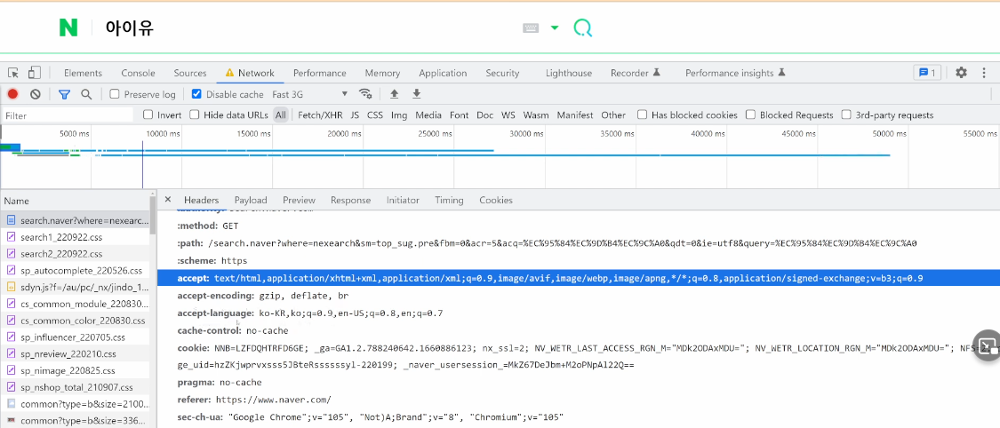
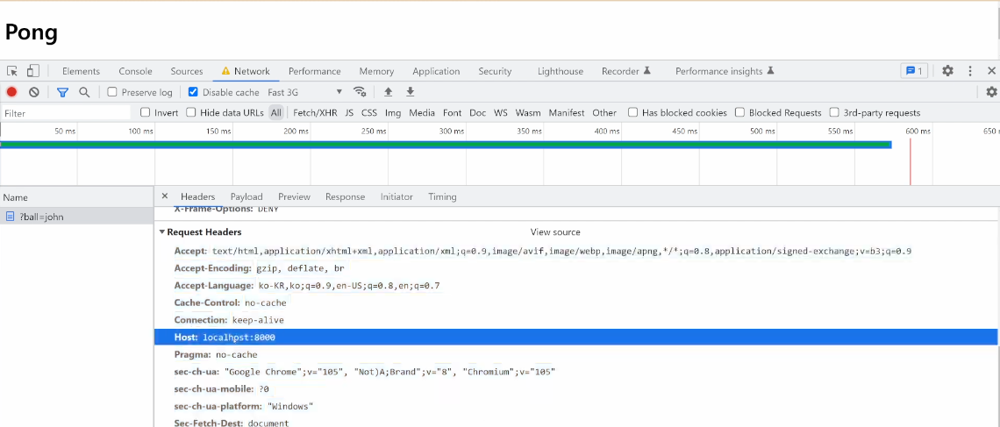
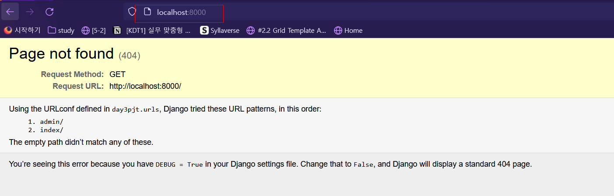
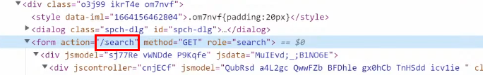
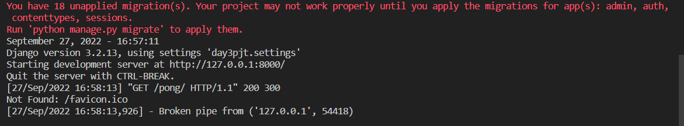

---

Varialble routing 작성 

view 함수 작성 

https://search.naver.com  = > 주소(누구에게)

/search.naver? => 주문서(무엇을)

? => 파라미터 

query(검색어)= 아이유 (%EC%95%84%EC%9D%B4%EC%9C%A0)

/search.naver? query

----

localhost:8000 으로 page not found가 될 경우8000 대신 index라고 검색해주기 

알맞게 나옴 

구글 폼 개발자 도구 

---

많은 메서드 확인 

---

---

부트스트랩

