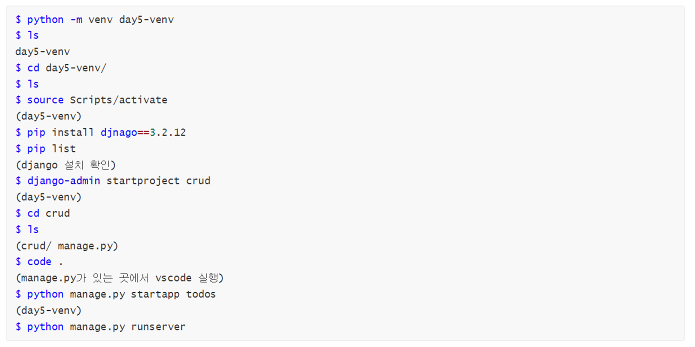
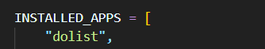
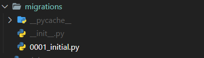
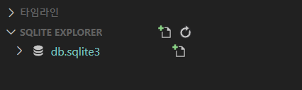
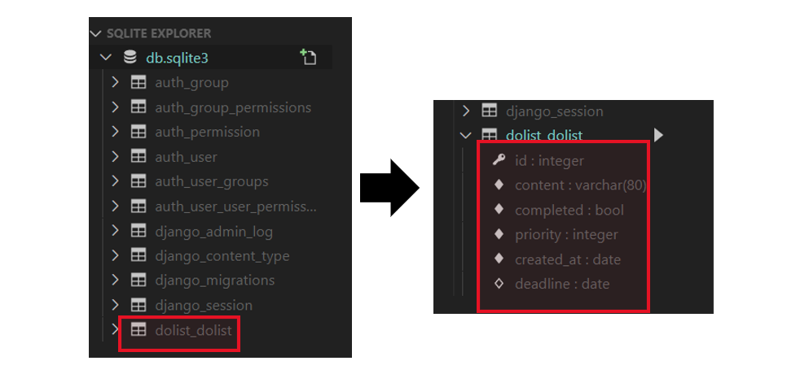
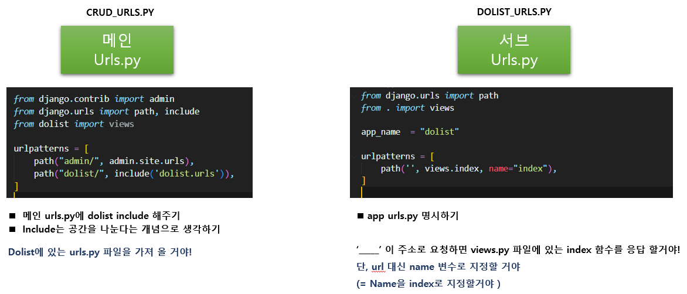
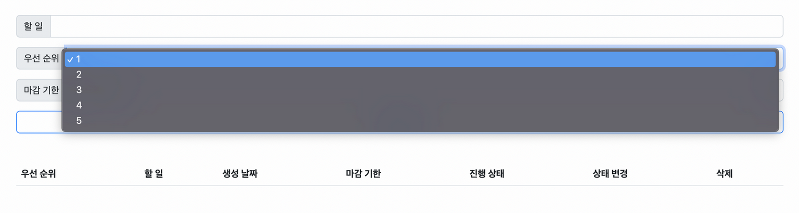
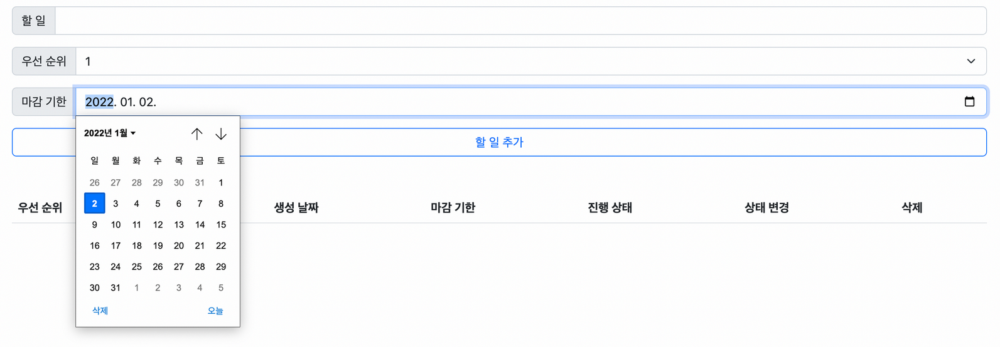
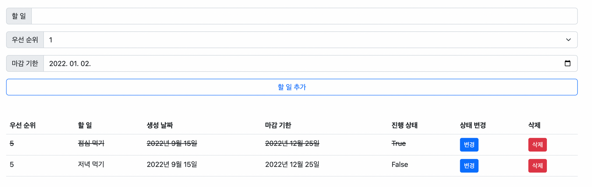

### 🌾 목표 

---

##### ◼ Stack : Django 

---

* #### CRUD 기능을 가진 Todo 서비스를 개발합니다.

---



---

### 🌾 요구사항 

---

##### ◼ python manage.py startapp dolist 

> ##### 앱을 생성했다면 setting.py에 등록을 한다. 
>
> 

---

### ⚒ 모델 Model 

* ##### 모델은 아래 조건을 만족해야 합니다. 

  ##### 다만, 기능 추가를 위해 필드를 추가해도 됩니다. 

  * #####  모델 이름 : Todo 

  * ##### 모델 필드 및 속성 


##### ◼ 모델을 정의한다. 

> #####  models.py 에서 데이터를 모델 필드 및 속성을 참고하여 정의한다. 
>
> ##### ✔ 필드 이름 = models.Char필드(속성)

```python
class Dolist(models.Model):
    content = models.CharField(max_length=80)
    completed = models.BooleanField(default=False)
    priority = models.IntegerField(default=3)
    created_at = models.DateField(default=3)
    deadline = models.DateField(null=True)
```

##### 

##### ◼ db.sqlite3의 새로운 테이블을 만들기 위해 설계도를 정의한다. 

```bash
$ python manage.py makemigrations
$ python manage.py migrate
```

**1️⃣ python manage.py makemigrations**

> * migrations 폴더에 0001_initial.py 파일 생성 확인 
> * open database 을 통해 db.sqlite3 확인 
>   * db.sqlite3을 확인해보면 아직 아무것도 없는 것을 확인 할 수 있다. 
>   * 그 이유는 migrate을 안했기 떄문이다. 
>   * migrate :  이주하다 라는 뜻이다. 이는 곳, 설계도를 만ㄷ르어 놓은 것을 데이터베이스 파일을 이주하겠다 라는 뜻!





2️⃣ **python manage.py migrate**

> * python manage.py migrate를 한 후 다시 open database를 통해 db.sqlite3 확인하기 
> * db.sqlite.3 > dolist_dolist 
>   * **앞 dolist : app name** 
>   * **뒤 dolist :  model name**
> * dolist 에 보면 내가 설계한 데이터 정보를 확인 할 수 있다. 




---


---





### ⚒ 기능 View

#### 할 일 추가하기 Create 

> ##### 💡 힌트 
>
> 1. create() 메소드를 활용 합니다. 
> 2. 아래 데이터를 사용자에게 입력받아서 데이터를 생성합니다. 
>    * 내용 / 우선순위 / 마감 기한 
> 3. 할 일 목록 페이지로 redirect 합니다. 


#### 할 일 목록 보기 Read

> ##### 💡 힌트
>
> 1.  모든 데이터를 id를 기준으로 오름차순으로 정렬해서 불러옵니다. 
> 2. 불러온 데이터를 템플릿에서 반복문을 사용해 1개씩 화면에 표시합니다. 


#### 할일 완료(completed) 여부 (True/False) 변경하기 Update

> ##### 💡 힌트 
>
> 1. 삭제할 할 일의 id가 필요합니다. 
> 2. get() 메소드를 사용하여 변경할 데이터를 불러옵니다. 
> 3. 불러운 데이터의 상태를 변경 후 저장합니다. 
> 4. 할 일 목록 페이지로 redirect 합니다. 


#### 할 일 삭제하기 Delete

> ##### 💡 힌트
>
> 1. 삭제할 할일의 id가 필요합니다. 
> 2. get() 메소드를 사용하여 변경할 데이터를 불러옵니다. 
> 3. 불러온 데이터를 삭제합니다. 
> 4. 할 일 목록 페이지로 redirect 합니다. 


### ⚒ 기능 View


#### 할일 추가 폼 form 

* ##### 할 일 

  * <input type = “text"> 태그를 활용합니다. 
  * 최대 입력 길이는 80입니다.


* ##### 우선 순위 

  * <select> <option> 태그를 활용합니다.

> select option 태그를 활용합니다. 

> 참고 자료 : https://thrillfighter.tistory.com/572


* ##### 마감기한 

  * <input type="date"> 태그를 활용합니다.


* #####  할 일 추가 버튼 

  * <input type="submit"> 태그를 활용합니다.







* #####  할 일 목록 테이블 table

  * ###### thead

    * 우선 순위, 힐일 내용, 생성 날짜 마감기한, 진행 상태, 상태 변경, 삭제를 테이블 헤더로 사용 

  * ###### tbody 

    * id를 기준으로 오름차순으로 정렬한 모든 데이터를 화면에 표시합니다. 

  * ###### 변경 

    * 버튼을 누르면 해당 할 일의 상태 (True/False) 가 수정됩니다. 

  * ###### 삭제 

    * 버튼을 누르면 해당 할 일이 삭제 됩니다. 

